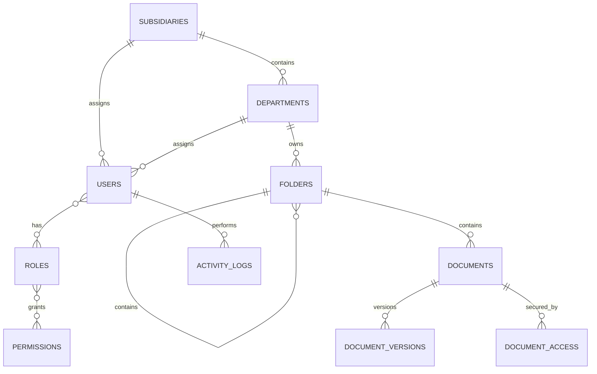

# Module 1 — Foundation and Normalized Database

## Completed scope

- Dedicated MySQL database configuration template for `rms_lara`
- Recursive `folders` hierarchy replacing `subfolder1` through `subfolder10`
- Organization, users, authorization, documents, versions, access, audit, file type, and setting tables
- Four system roles and their initial permission matrix
- Recommended file types with a configurable 100 MiB default limit
- Private `documents` filesystem disk
- React 19 dependency alignment
- Public self-registration disabled
- Foundation schema tests

The legacy CI3 ZIP and `RMSdb.sql` remain read-only references and are not included or connected.

## Database relationships



## Installation on the existing Laragon project

1. Stop `php artisan serve` and `npm run dev`.
2. Back up `C:\laragon\www\arms-laravel`.
3. Extract the package and copy its `arms-laravel` contents over the existing project.
4. Keep the existing `.env` and `.env.testing`; they are intentionally excluded from the package.
5. Run `composer install`.
6. Run `npm install` to install React 19 and update local frontend dependencies.
7. Confirm `.env` uses `DB_DATABASE=rms_lara` and `.env.testing` uses `DB_DATABASE=rms_lara_testing`.
8. Because this is a new empty project database, run `php artisan migrate:fresh --seed`.
9. Run `php artisan optimize:clear`, `php artisan test`, and `npm run build`.
10. Start local development with `php artisan serve` and `npm run dev` in separate terminals.

`migrate:fresh` deletes every table in the configured database. Never run it against the legacy database or a database containing required data.

## Expected seeded roles

| Role | Initial access |
|---|---|
| Super Administrator | All permissions, including file deletion |
| Administrator | All permissions except file deletion |
| Records Officer / Uploader | Dashboard, view, download, and upload |
| Viewer / User | Dashboard and view only |

No production user or default password is seeded. The first Super Administrator will be created through a controlled Module 2 command.

## Verification

```powershell
php artisan migrate:status
php artisan db:show
php artisan test
npm run build
```

The application URL remains `http://127.0.0.1:8000`.

